# Prerequisite: <a href="https://docs.docker.com/get-docker/"></a>
> Please have [Docker](https://docs.docker.com/get-docker/) installed! 
>
<br>

#
# <br><span style="color:#D63484; text-align:center; display: block;"> Setup </span> </br>

### Step 1: Clone the project 
```bash
git clone https://github.com/mindullness/s4prj-docker.git
```
### Step 2: Change to the directory <span style="color:orange">`s4prj-docker`</span>
```bash
cd s4prj-docker
```
### Step 3: Run command, and wait few minutes
```css
docker-compose up --build -d
```

- #### All services started
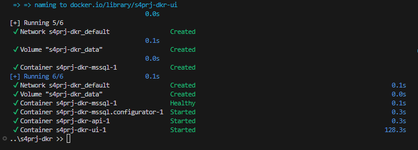
- #### MS SQL database container's health checked
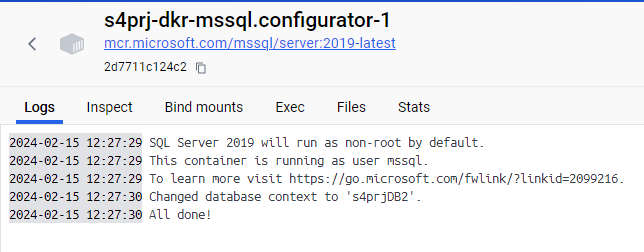
- #### Backend container initialized database records
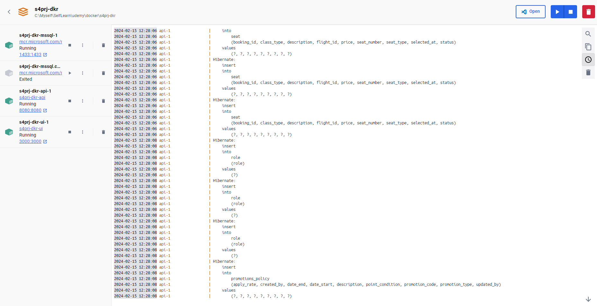

##
Then here we go
##
# <br><span style="color:#D63484; text-align:center; display: block;"> Booking </span> </br>

#### 1. Access browser on <a href="http://localhost:3000/" target="blank">localhost:3000</a>, on the current day, only <span style="color:yellow;">`Hanoi (HAN)`</span> and <span style="color:yellow;">`Ho Chi Minh (SGN)`</span> destinations are available:
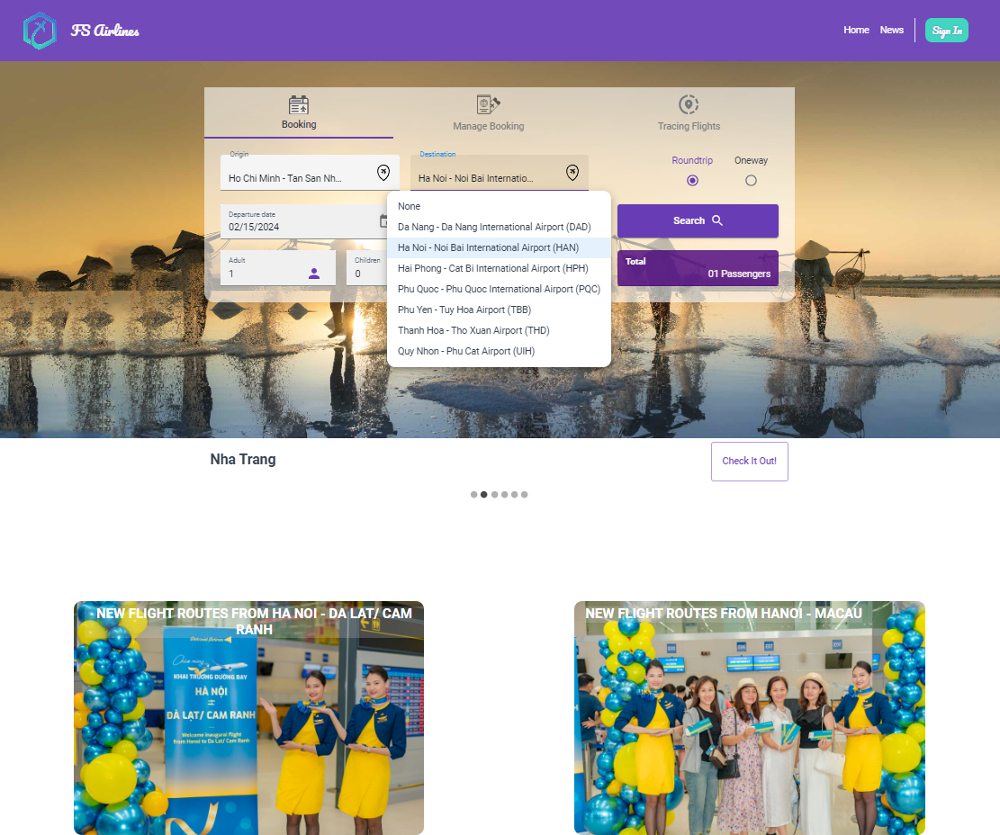

#### 2. Select your flight
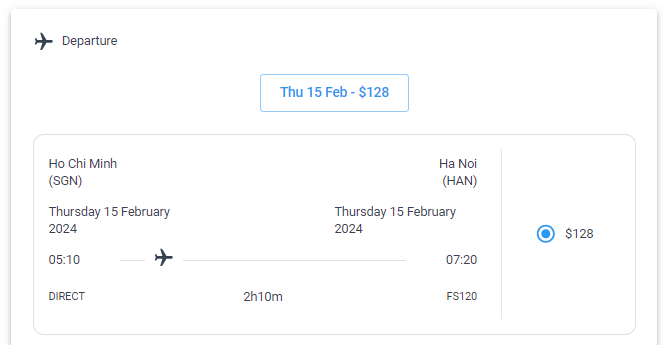


#### 3. Input your information
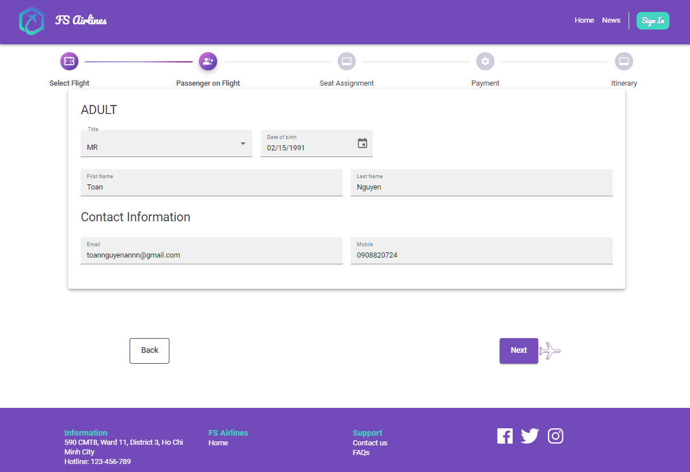

#### 4. Select Seat For Departure
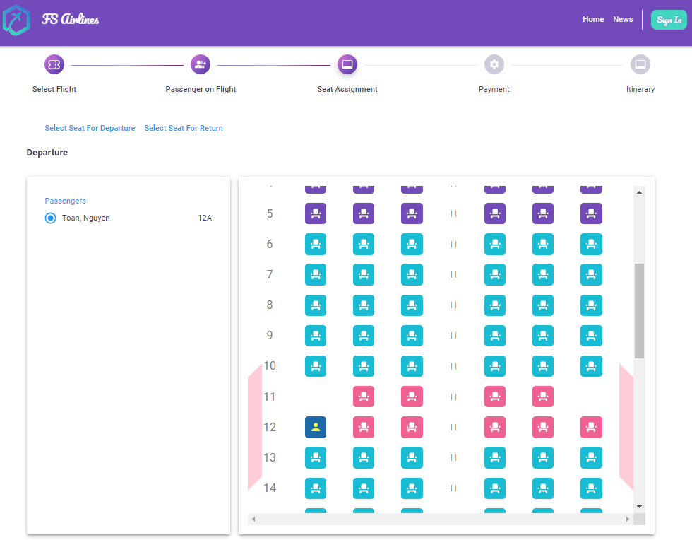

#### 5. Payment with PayPal (dev-sandbox) account
- Login account:
  - Username: flight@personal.example.com
  - Password: flight@123

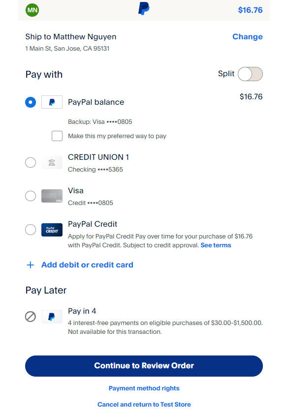

#### 6. Complete Payment
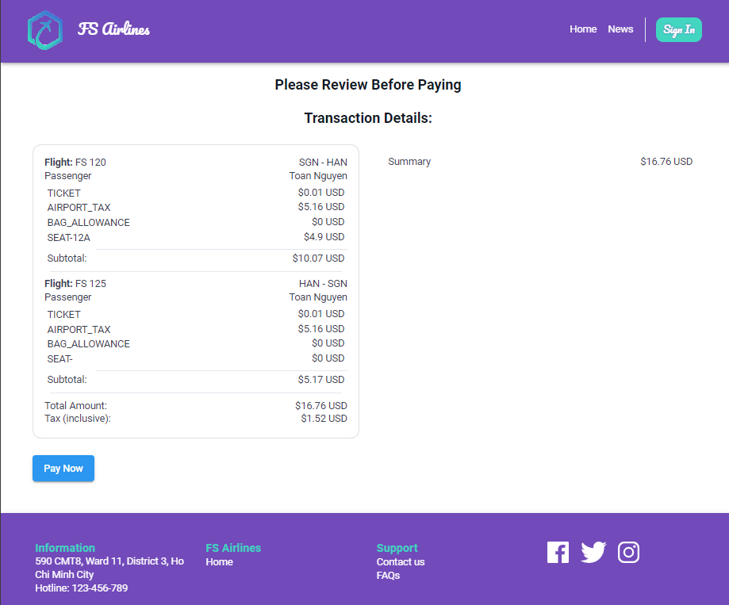

#### 7. Ticket itinerary (Booking Number)
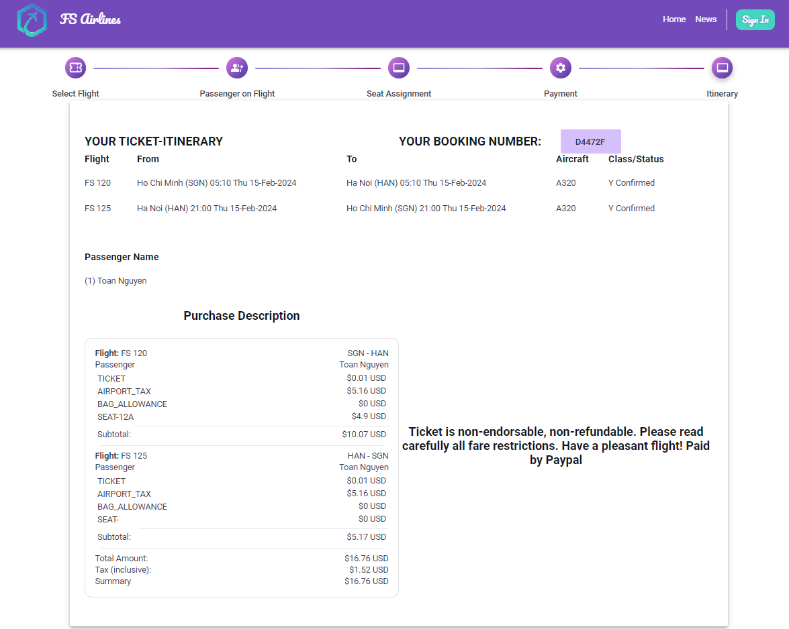

#
# </br><span style="color:#D63484;text-align:center; display: block">Check-In - Get Boarding Pass</span> </br>

#### 1. Search PNR
- Back to Homepage
- Choose Manage Booking
- search PNR from the Initerary, here is "D4472F"

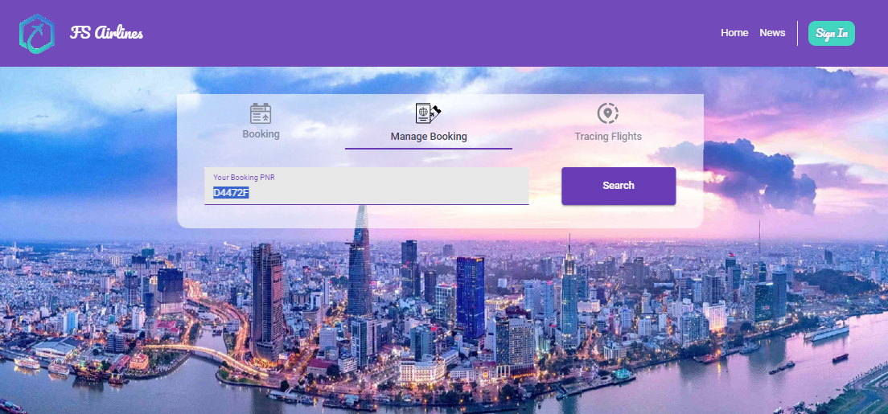  

#### 2. Choose your flight to check-in
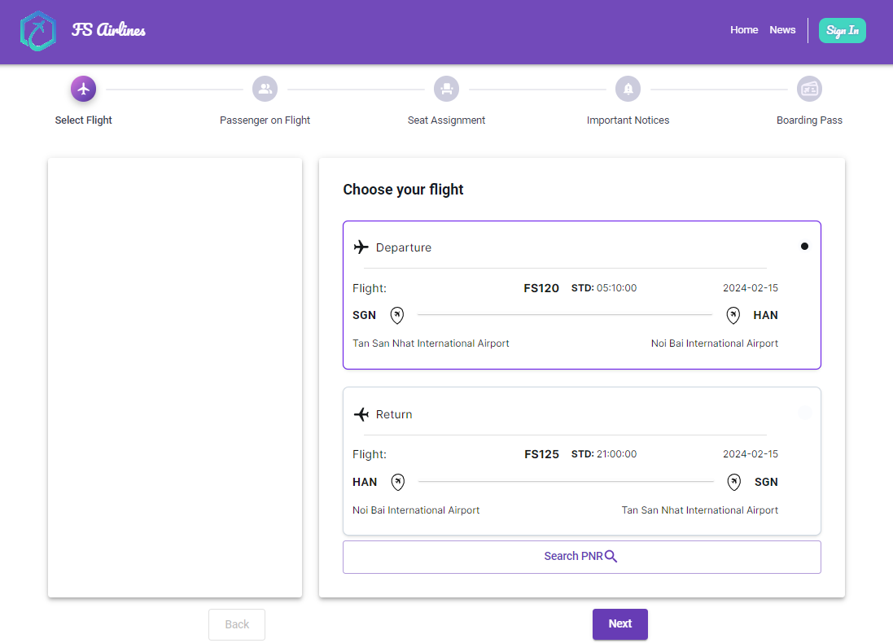

#### 3. Select passenger
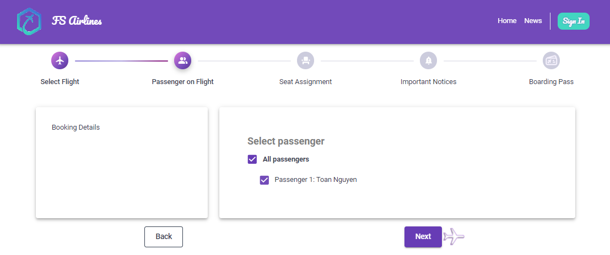

#### 4. Aggree Term & Conditions
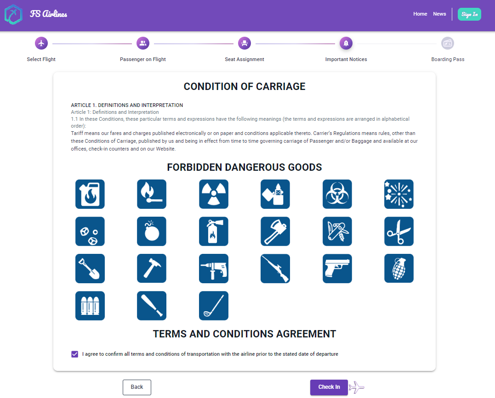

#### 5. Save your Boarding Pass
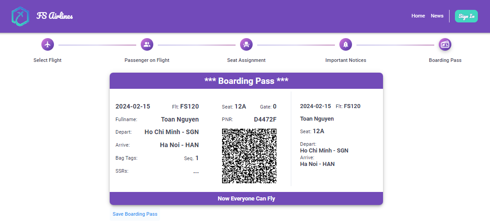 
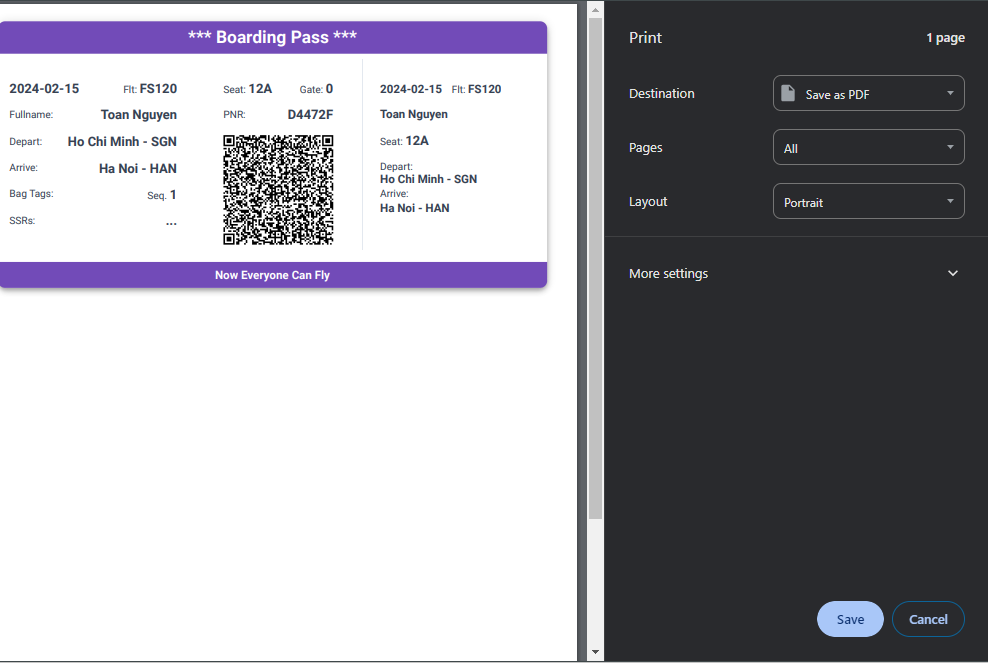

#
#
# <span style="color:#D63484; text-align:center; display: block"> ✈️ Enjoy Your Flight !!! </span> 
##

#
# </br><span style="color:#D63484;text-align:center; display: block">Clean Up</span> </br>

#### 1. Run command below and wait `Docker` to stop, and remove all containers. 

```css
docker-compose down
```
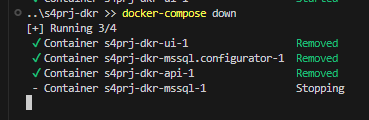

#### 2. Delete all the images
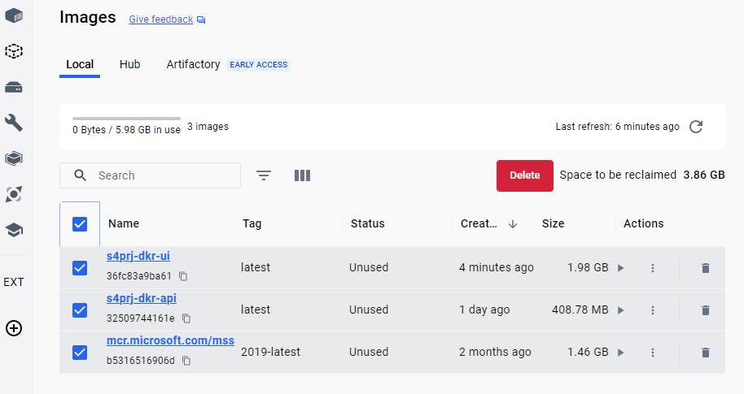
